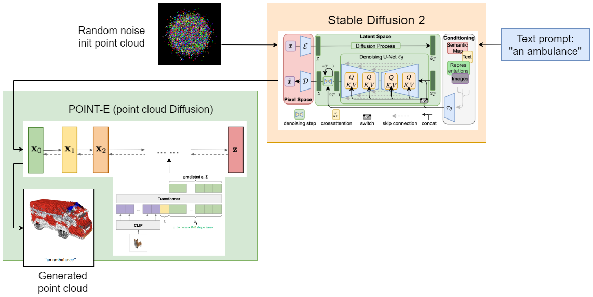

# Stable, multi-view Point·E
This repository collects experiments with Point-E to improve the quality of generated point clouds from text and images.
It is based on the [official implementation repository](https://github.com/openai/point-e), and it introduces the following modifications:

- Multi-view with stochastic conditioning in the diffusion denoising process, see: [`sc_point_e/models/transformer.py`](/sc_point_e/models/transformer.py)

<em>Original image: <a href="https://arxiv.org/abs/2212.08751">Nichol et al. 2022</a></em>
<br>
<br>

- Multi-view with patch concatenation in the denoiser transformer, see: [`mv_point_e/models/transformer.py`](/mv_point_e/models/transformer.py)

<em>Original image: <a href="https://arxiv.org/abs/2210.04628">Watson et al. 2022</a></em>
<br>
<br>

## Setup
There are two variants for multi-view:
- Patch concatenation: `mv_point_e`
- Stochastic conditioning: `sc_point_e`

You can either: 
1. Rename the folder of version you choose to `point_e` and run `pip install -e .` 
2. Without installing a global package, import from the specific variant in your code, e.g. for `sc_point_e`:
```
from sc_point_e.diffusion.configs import DIFFUSION_CONFIGS, diffusion_from_config
from sc_point_e.diffusion.sampler import PointCloudSampler
from sc_point_e.models.download import load_checkpoint
from sc_point_e.models.configs import MODEL_CONFIGS, model_from_config

from sc_point_e.evals.feature_extractor import PointNetClassifier, get_torch_devices
from sc_point_e.evals.fid_is import compute_statistics
from sc_point_e.evals.fid_is import compute_inception_score
from sc_point_e.util.plotting import plot_point_cloud
```

## Experiments
- [x] ([Notebook 1](notebooks/1_local_stable_point_e.ipynb)) Use synthetic views from Stable Diffusion 2, inpainted in "white booths"
- [x] ([Notebook 2](notebooks/2_local_srncars_multiview_point_e.ipynb)) Feed multiple views to Point-E (simple patch concatenation)
- [x] ([Notebook 3](3d-diffusion/3_local_stable3dim_multiview_point_e.ipynb)) From a synthetic view, generate novel views with [3D-Diffusion (Watson et al. 2022)](https://3d-diffusion.github.io)
- [x] ([Notebook 4](notebooks/4_local_photo_point_e.ipynb)) Pre-process photos 'in the wild' and generate a point-cloud
- [x] ([Notebook 5](notebooks/5_eval_single_obj.ipynb), [Notebook 6](notebooks/6_eval_shapenet.ipynb)) Evaluate on ShapeNetv0-obj, metrics: P-IS, P-Wasserstein-Euclidean Distance
- [x] ([Notebook 7](notebooks/7_eval_views_pika.ipynb)) Testing multi-view point-e against single view on occluded object parts
- [x] Feed multiple views to Point-E (stochastic conditioning as in [Watson et al. 2022](https://arxiv.org/abs/2210.04628))

# Evaluation datasets

- 
- OpenAI's seed images and clouds from the repo's banner [here](https://openaipublic.azureedge.net/main/point-e/banner_pcs.zip).
- OpenAI's seed imaves for COCO CLIP R-Precision evaluations [here](https://openaipublic.azureedge.net/main/point-e/coco_images.zip).
