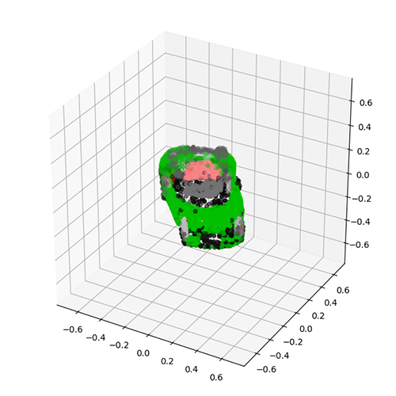

<table>
    <tr>
        <td></td>
        <td></td>
        <td></td>
    </tr>
</table>

<br>

# Stable, multi-view Point·E
Point-E is a [diffusion model](https://halixness.github.io/2023/intro-to-diffusion/): a generative model that approximates a data distribution through noising (forward process) and denoising (backward process). The backward process is also named "sampling", as you start from a noisy point in the distribution and convert it back to signal with some conditional information. In Point-E, we start from a random point cloud of 1024 points and denoise it with images (an object photo) as conditioning signal.

Compared to other techniques in literature, such as [Neural Radiance Fields](https://arxiv.org/abs/2003.08934), you can sample a point cloud with Point-E with a single gpu in 1-2 minutes. Sample quality is the price to pay, making this technique  ideal for task where point clouds are best suited.

This repository collects experiments with Point-E to improve the quality of generated point clouds from text and images.
It is based on the [official implementation repository](https://github.com/openai/point-e) and it introduces modifications/ideas for improvement.

## Table of contents

1. [Contributions](#contributions)
2. [Setup](#setup)
3. [Experiments](#experiments)
4. [Evaluation](#evaluation)


## Contributions

### Multi-view with patch concatenation
Each conditioning image is encoded with the pre-trained [OpenAI CLIP](https://arxiv.org/abs/2103.00020), all the resulting embeddings are concatenated and fed as tokens into the denoising transformer. <br>
See: [`mv_point_e/models/transformer.py`](/mv_point_e/models/transformer.py)
<br>
<br>

<br>
<em>
    Original image: <a href="https://arxiv.org/abs/2210.04628">Watson et al. 2022</a>
</em>
<br>
<br>

### Multi-view with stochastic conditioning
With inspiration from <a href="https://arxiv.org/abs/2210.04628">Watson et al. 2022</a>, a random conditioning image (from a given multi-view set) is fed to the denoising transformer at each diffusion denoising step.<br>
See: [`mv_point_e/models/transformer.py`](/mv_point_e/models/transformer.py)
<br>
<br>

<br>
<em>
    Original image: <a href="https://arxiv.org/abs/2210.04628">Watson et al. 2022</a>
</em>
<br>
<br>

### Multiple synthetic views with 3D-Diffusion 
We use 3D-Diffusion from [Watson et al. 2022](https://arxiv.org/abs/2210.04628) to generate 3d-consistent multiple views from a single, text-generated image (with stable diffusion 2). The current model is pre-trained on [SRNCars](#), a ShapeNet version will be released soon ([contribute here](https://github.com/halixness/distributed-3d-diffusion-pytorch)).
<br>
<br>

<br>
<em>
    Original image: <a href="https://arxiv.org/abs/2210.04628">Watson et al. 2022</a>
</em>
<br>
<br>

## Setup
There are two variants for multi-view:
- Patch concatenation: `mv_point_e`
- Stochastic conditioning: `sc_point_e`

You can either: 
1. Rename the folder of version you choose to `point_e` and run `pip install -e .` 
2. Without installing a global package, import from the specific variant in your code, e.g. for `sc_point_e`:
```
from sc_point_e.diffusion.configs import DIFFUSION_CONFIGS, diffusion_from_config
from sc_point_e.diffusion.sampler import PointCloudSampler
from sc_point_e.models.download import load_checkpoint
from sc_point_e.models.configs import MODEL_CONFIGS, model_from_config

from sc_point_e.evals.feature_extractor import PointNetClassifier, get_torch_devices
from sc_point_e.evals.fid_is import compute_statistics
from sc_point_e.evals.fid_is import compute_inception_score
from sc_point_e.util.plotting import plot_point_cloud
```

## Experiments
- [x] ([Notebook 1](1_local_stable_point_e.ipynb)) Use synthetic views from Stable Diffusion 2, inpainted in "white booths"
- [x] ([Notebook 2](2_local_srncars_multiview_point_e.ipynb)) Feed multiple views to Point-E (simple patch concatenation)
- [x] ([Notebook 3](3d-diffusion/3_local_stable3dim_multiview_point_e.ipynb)) From a synthetic view, generate novel views with [3D-Diffusion (Watson et al. 2022)](https://3d-diffusion.github.io)
- [x] ([Notebook 4](4_local_photo_point_e.ipynb)) Pre-process photos 'in the wild' and generate a point-cloud
- [x] ([Notebook 5](5_eval_single_obj.ipynb), [Notebook 6](6_eval_shapenet.ipynb)) Evaluate on ShapeNetv0-obj, metrics: P-IS, P-Wasserstein-Euclidean Distance
- [x] ([Notebook 7](7_eval_views_pika.ipynb)) Testing multi-view point-e against single view on occluded object parts
- [x] ([Notebook 8](8_eval_mv_sc.ipynb)) Feed multiple views to Point-E (stochastic conditioning as in [Watson et al. 2022](https://arxiv.org/abs/2210.04628))

## Evaluation

Command-line evaluation script `eval.py`:
```
python eval.py --input_views n_w_h_rgb_tensor.pt \
               --ground_point_cloud n_k_rgb_clouds_tensor.pt \
               --num_points 1024 --num-views 4
```

| Name          | Samples      | Source        |
|---            |---        |---            |
| ModelNet40, textureless    |   10     | [Google Drive](https://drive.google.com/file/d/1unP1Sft7Fd_Z8CsvuT998UYWaJoUlkzv/view?usp=share_link)             |   
| ShapeNetv0, textureless    |   55     | [Google Drive](https://drive.google.com/file/d/1STnQs9Tm6QlXkmPgiIp11CrLuABhfuQi/view?usp=share_link)             |   
| Mixed, textureless    |   95     | [Google Drive](https://drive.google.com/file/d/1HWnUt1O57uDeG3GeOVqIpRJuMb4nEMUb/view?usp=share_link)             | 
| OpenAI seed imgs/clouds    |   /     | [Google Drive](https://openaipublic.azureedge.net/main/point-e/banner_pcs.zip)             |   
| OpenAI, COCO CLIP R-Precision evals    |   /     | [Google Drive](https://openaipublic.azureedge.net/main/point-e/coco_images.zip)             |   

<br>

## Credits
- [a6o: 3d-diffusion implementation](https://github.com/a6o/3d-diffusion-pytorch)
- [OpenAI: official Point-E implementation](https://github.com/openai/point-e)
- [RemBG: background removal, U^2 Net implementation](https://github.com/danielgatis/rembg)